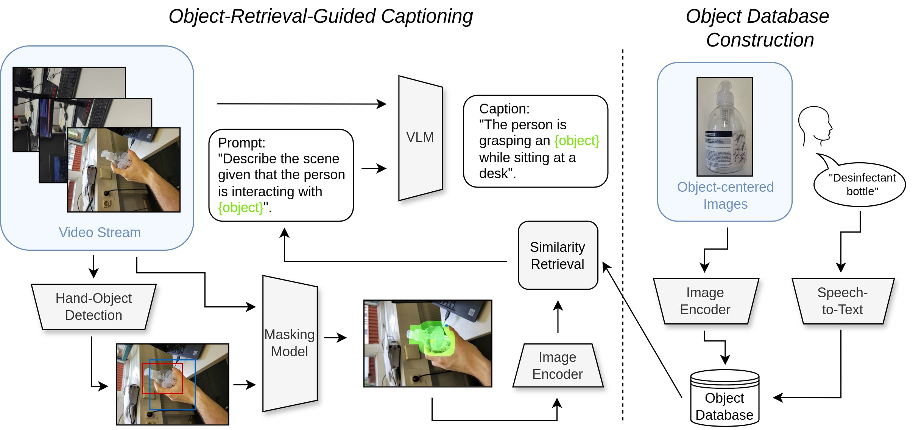
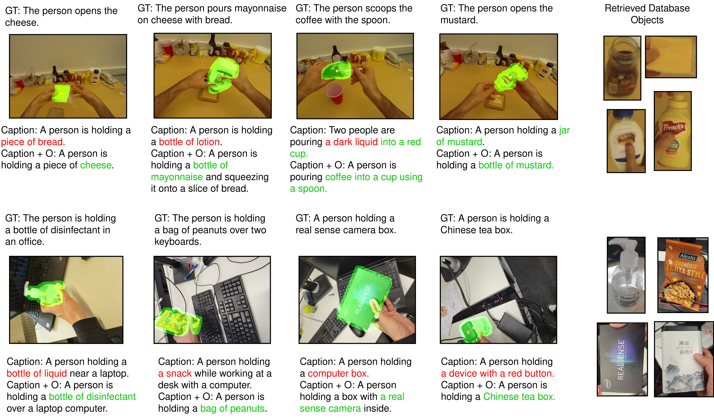

# Real-Time Object Retrieval Augmented VLM Captioning Agent
This repo contains a retrieval augmented method for improving object consistency in VLM (Vision Language Models) captions.

<p align="center">
  
</p>


## Environment Configuration and Requirements


Python 3.9
Conda Environment file provided
```text
conda env create -f environment.yml
```


- **[VLMs]** Clone VLM repositories or use huggingface model cards if available
- **[HOI detector]** Clone the HOI Detector model from here: https://github.com/ddshan/hand_object_detector
- **[HOI detector weights]** Download this model checkpoint into models folder: https://drive.google.com/file/d/1H2tWsZkS7tDF8q1-jdjx6V9XrK25EDbE/view
- **[SAM segmentation]** Use MobileSAM checkpoint from here: https://github.com/ChaoningZhang/MobileSAM or use SAM checkpoint from ultralytics (https://docs.ultralytics.com/de/models/mobile-sam/)

- **[GTEA dataset]** Download the GTEA dataset (https://cbs.ic.gatech.edu/fpv/) and construct annotations with "parsing ground truth gtea.py"

## Repository Structure
```text
Object-Retrieval-VLM
├── HOI detector
├── models
├── data
│   ├── GTEA
│   ├── User-study (own experiments)
│   │   └── user_1
│   │   │   └── database
│   │   └── user_2
│   │   │   └── database
├── InternVL
├── MiniGPT-4
├── annotate.py (for database construction)
├── vlm_object_retrieval_inference.py (inference on continuous smartphone video stream)
├── vlm_object_retrieval_inference_offline.py (public database)
├── eval_caps.py (for evaluation)
├── moblie_sam.pt (SAM checkpoint)
```

## Qualitative Results
These are some qualitative results on the GTEA and our own in-the-wild user-study.

<p align="center">
  
</p>

## Citation
If you use the code/models hosted in this repository, please cite the following paper:

```text
TBD
```
